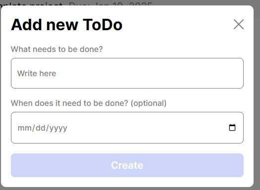
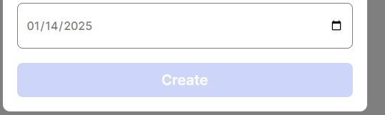
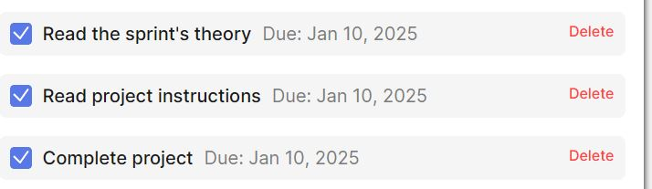

# Simple Agenda List

App meant to help organize your day with due dates and check boxes.

## Overview

Project is a simple to do app using Javascript and ES6 classes.

## Functionality

Ability to add to do tasks with a date that it's due. As the items on the list are finished, user will be able to check box them off and it will tell how many more tasks need to be completed, as well as show the completed tasks. Delete button allows the user to delete items on the list should they no longer need to be done. Ability to also add a task without a due date.

## Technology

A formValidator.js file is used to ensure there is a task in the What needs to be done? box and stops the user from clicking the create button until there is a certain amount of letters entered.

The todo.js allows the user to pick a due date if they choose too. Also allows for the task to be checkmarked off.

## Screenshots

 When add to do is clicked, a box pops up allowing you to add the task and date.

 Able to add a to finish by date to the task.

 As tasks are completed, they can be checkmarked off. Also a delete button allows you to discard the task should it no longer be required.

## Features

- Add new
- Set a due date
- Mark them as they are completed
- Delete tasks as needed

## Deployment

This project is deployed on GitHub Pages:

- [GitHub Link](https://milialeana.github.io/se_project_todo-app/)
